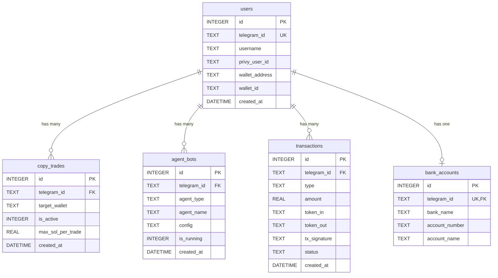

# Design Document: SQLite Database Module

## Overview

The SQLite Database Module provides a persistent storage layer for the Solana AI agent wallet Telegram bot. It implements a synchronous database interface using the better-sqlite3 library, managing five core tables: users, copy trades, agent bots, transactions, and bank accounts.

The module follows a functional design pattern, exposing individual database operations as exported functions while maintaining a single database connection instance. All operations use the synchronous better-sqlite3 API for simplicity and predictability in the Node.js environment.

Key design principles:
- **Synchronous operations**: All database calls are synchronous, eliminating callback/promise complexity
- **Single connection**: One database instance shared across all operations
- **Automatic initialization**: Database and tables created on first import
- **CommonJS compatibility**: Uses require/module.exports for Node.js integration
- **Fail-fast error handling**: Errors propagate to callers for explicit handling

## Architecture

### Module Structure

```
src/db.js (Database Module)
├── Database Instance (better-sqlite3)
├── Initialization Functions
│   └── initDB()
├── User Operations
│   ├── getUserByTelegramId()
│   ├── createUser()
│   └── updateUserWallet()
├── Copy Trading Operations
│   ├── getCopyTrades()
│   ├── addCopyTrade()
│   └── removeCopyTrade()
├── Agent Bot Operations
│   ├── getAgentBots()
│   ├── addAgentBot()
│   └── updateAgentStatus()
├── Transaction Operations
│   └── logTransaction()
└── Bank Account Operations
    ├── saveBankAccount()
    └── getBankAccount()
```

### Database Schema

The module manages five tables with the following relationships:



### Data Flow

1. **Module Import**: When the module is first required, it creates the database connection and initializes tables
2. **Operation Invocation**: Calling code invokes exported functions with required parameters
3. **SQL Execution**: Functions execute prepared statements synchronously
4. **Result Return**: Query results or modified row information returned directly to caller
5. **Error Propagation**: Any SQLite errors thrown to calling code for handling

## Components and Interfaces

### Database Connection Component

**Responsibility**: Manage the SQLite database connection and file system setup

**Interface**:
```javascript
const Database = require('better-sqlite3');
const db = new Database('./data/agent_wallet.db');
```

**Implementation Details**:
- Creates `./data` directory if it doesn't exist using `fs.mkdirSync` with `recursive: true`
- Opens database file at `./data/agent_wallet.db`
- Connection remains open for the lifetime of the application
- Exported as default export for direct SQL access if needed

### Initialization Component

**Responsibility**: Create database schema on first run

**Interface**:
```javascript
function initDB()
```

**Implementation Details**:
- Uses `CREATE TABLE IF NOT EXISTS` for idempotent table creation
- Executes five CREATE TABLE statements for all required tables
- Sets appropriate column types, primary keys, unique constraints, and defaults
- Called automatically when module is imported
- Safe to call multiple times (no-op if tables exist)

### User Management Component

**Responsibility**: CRUD operations for user records

**Interface**:
```javascript
function getUserByTelegramId(telegramId)
// Returns: user object or null

function createUser(telegramId, username, privyUserId, walletAddress, walletId)
// Returns: newly created user object

function updateUserWallet(telegramId, walletAddress, walletId, privyUserId)
// Returns: undefined (modifies existing record)
```

**Implementation Details**:
- `getUserByTelegramId`: Uses prepared statement with `get()` method
- `createUser`: Uses prepared statement with `run()` method, retrieves inserted row with `lastInsertRowid`
- `updateUserWallet`: Uses prepared statement with `run()` method for UPDATE query
- All functions use parameterized queries to prevent SQL injection

### Copy Trading Component

**Responsibility**: Manage copy trading configurations

**Interface**:
```javascript
function getCopyTrades(telegramId)
// Returns: array of active copy trade configurations

function addCopyTrade(telegramId, targetWallet, maxSolPerTrade)
// Returns: undefined (inserts new record)

function removeCopyTrade(telegramId, targetWallet)
// Returns: undefined (soft deletes by setting is_active = 0)
```

**Implementation Details**:
- `getCopyTrades`: Filters by `telegram_id` and `is_active = 1`, uses `all()` method
- `addCopyTrade`: Inserts with current timestamp using `datetime('now')`
- `removeCopyTrade`: Soft delete pattern - sets `is_active = 0` instead of DELETE
- Soft delete preserves historical data for audit purposes

### Agent Bot Component

**Responsibility**: Manage AI agent bot configurations

**Interface**:
```javascript
function getAgentBots(telegramId)
// Returns: array of agent bot configurations

function addAgentBot(telegramId, agentType, agentName, config)
// Returns: undefined (inserts new record)

function updateAgentStatus(botId, isRunning)
// Returns: undefined (updates is_running field)
```

**Implementation Details**:
- `getAgentBots`: Returns all bots for user (no filtering by is_running)
- `addAgentBot`: Stores config as TEXT (JSON stringified by caller)
- `updateAgentStatus`: Updates by bot id (not telegram_id)
- `is_running` stored as INTEGER (0 or 1) for SQLite boolean compatibility

### Transaction Logging Component

**Responsibility**: Record transaction history

**Interface**:
```javascript
function logTransaction(telegramId, type, amount, tokenIn, tokenOut, txSignature, status)
// Returns: undefined (inserts new record)
```

**Implementation Details**:
- Insert-only operation (no updates or deletes)
- Captures timestamp automatically with `datetime('now')`
- All parameters stored as-is without validation
- Designed for append-only audit log pattern

### Bank Account Component

**Responsibility**: Manage bank account information for off-ramp

**Interface**:
```javascript
function saveBankAccount(telegramId, bankName, accountNumber, accountName)
// Returns: undefined (inserts or updates record)

function getBankAccount(telegramId)
// Returns: bank account object or null
```

**Implementation Details**:
- `saveBankAccount`: Uses INSERT OR REPLACE pattern for upsert behavior
- `getBankAccount`: Simple SELECT by telegram_id
- One bank account per user enforced by UNIQUE constraint on telegram_id

## Data Models

### User Model

```javascript
{
  id: INTEGER,              // Auto-increment primary key
  telegram_id: STRING,      // Unique Telegram user identifier
  username: STRING,         // Telegram username
  privy_user_id: STRING,    // Privy authentication service ID
  wallet_address: STRING,   // Solana wallet public address
  wallet_id: STRING,        // Internal wallet identifier
  created_at: STRING        // ISO 8601 timestamp
}
```

**Constraints**:
- `telegram_id` must be unique
- `created_at` defaults to current timestamp

### Copy Trade Configuration Model

```javascript
{
  id: INTEGER,              // Auto-increment primary key
  telegram_id: STRING,      // Foreign key to users
  target_wallet: STRING,    // Wallet address to copy
  is_active: INTEGER,       // 1 = active, 0 = inactive
  max_sol_per_trade: REAL,  // Maximum SOL per trade
  created_at: STRING        // ISO 8601 timestamp
}
```

**Constraints**:
- `is_active` defaults to 1
- `max_sol_per_trade` defaults to 0.1
- Multiple configurations per user allowed

### Agent Bot Configuration Model

```javascript
{
  id: INTEGER,              // Auto-increment primary key
  telegram_id: STRING,      // Foreign key to users
  agent_type: STRING,       // Type of agent (e.g., "trading", "monitoring")
  agent_name: STRING,       // User-defined agent name
  config: STRING,           // JSON configuration string
  is_running: INTEGER,      // 1 = running, 0 = stopped
  created_at: STRING        // ISO 8601 timestamp
}
```

**Constraints**:
- `is_running` defaults to 0
- `config` stored as TEXT (JSON serialized)
- Multiple bots per user allowed

### Transaction Model

```javascript
{
  id: INTEGER,              // Auto-increment primary key
  telegram_id: STRING,      // Foreign key to users
  type: STRING,             // Transaction type (e.g., "swap", "transfer")
  amount: REAL,             // Transaction amount
  token_in: STRING,         // Input token symbol
  token_out: STRING,        // Output token symbol
  tx_signature: STRING,     // Blockchain transaction hash
  status: STRING,           // Transaction status (e.g., "success", "failed")
  created_at: STRING        // ISO 8601 timestamp
}
```

**Constraints**:
- Append-only (no updates or deletes)
- All fields nullable except id and created_at

### Bank Account Model

```javascript
{
  id: INTEGER,              // Auto-increment primary key
  telegram_id: STRING,      // Foreign key to users (unique)
  bank_name: STRING,        // Name of bank
  account_number: STRING,   // Bank account number
  account_name: STRING      // Account holder name
}
```

**Constraints**:
- `telegram_id` must be unique (one bank account per user)
- All fields required for insert/update operations


## Correctness Properties

*A property is a characteristic or behavior that should hold true across all valid executions of a system—essentially, a formal statement about what the system should do. Properties serve as the bridge between human-readable specifications and machine-verifiable correctness guarantees.*

### Property 1: Database initialization is idempotent

*For any* number of calls to initDB, the database schema should remain consistent and existing data should be preserved without modification or duplication.

**Validates: Requirements 1.9**

### Property 2: User creation and retrieval round-trip

*For any* valid user data (telegramId, username, privyUserId, walletAddress, walletId), creating a user then retrieving it by telegram_id should return a record containing all the provided data.

**Validates: Requirements 2.2, 2.5, 2.6**

### Property 3: Non-existent user lookup returns null

*For any* telegram_id that has not been used to create a user, getUserByTelegramId should return null.

**Validates: Requirements 2.3**

### Property 4: User wallet update persistence

*For any* existing user and any new wallet data (walletAddress, walletId, privyUserId), calling updateUserWallet then retrieving the user should return the updated wallet information.

**Validates: Requirements 2.8**

### Property 5: Copy trade soft deletion removes from active results

*For any* active copy trade configuration, calling removeCopyTrade then getCopyTrades should not include the removed configuration in the results.

**Validates: Requirements 3.2, 3.6**

### Property 6: Copy trade creation makes configuration active

*For any* valid copy trade data (telegramId, targetWallet, maxSolPerTrade), calling addCopyTrade then getCopyTrades should include the new configuration with is_active = 1.

**Validates: Requirements 3.4**

### Property 7: Agent bot retrieval returns all user bots

*For any* set of agent bots created for a telegram_id, calling getAgentBots should return all bots for that user regardless of their is_running status.

**Validates: Requirements 4.2**

### Property 8: Agent bot creation initializes as stopped

*For any* valid agent bot data (telegramId, agentType, agentName, config), calling addAgentBot then retrieving the bot should show is_running = 0.

**Validates: Requirements 4.4**

### Property 9: Agent bot status update persistence

*For any* existing agent bot and any boolean isRunning value, calling updateAgentStatus then retrieving the bot should reflect the updated is_running status.

**Validates: Requirements 4.6**

### Property 10: Transaction logging round-trip

*For any* valid transaction data (telegramId, type, amount, tokenIn, tokenOut, txSignature, status), calling logTransaction then querying the transactions table should return a record containing all the provided data.

**Validates: Requirements 5.2, 5.3**

### Property 11: Bank account upsert behavior

*For any* telegram_id, calling saveBankAccount twice with different bank account data should result in exactly one bank account record with the most recent data (no duplicates).

**Validates: Requirements 6.3**

### Property 12: Bank account save and retrieve round-trip

*For any* valid bank account data (telegramId, bankName, accountNumber, accountName), calling saveBankAccount then getBankAccount should return a record containing all the provided data.

**Validates: Requirements 6.2, 6.5**

### Property 13: Non-existent bank account lookup returns null

*For any* telegram_id that has no associated bank account, getBankAccount should return null.

**Validates: Requirements 6.6**

### Property 14: Database errors propagate to caller

*For any* database operation that violates constraints or encounters errors (such as duplicate unique keys), the error should be thrown to the calling code rather than being silently caught.

**Validates: Requirements 7.5**

## Error Handling

### Error Propagation Strategy

The module follows a fail-fast error handling approach where all database errors are propagated to the calling code. This design choice enables:

1. **Explicit error handling**: Callers must handle errors appropriate to their context
2. **Debugging clarity**: Stack traces point to the actual error location
3. **Transaction control**: Callers can implement their own transaction logic

### Common Error Scenarios

**Constraint Violations**:
- Duplicate telegram_id in users table (UNIQUE constraint)
- Duplicate telegram_id in bank_accounts table (UNIQUE constraint)
- These throw SQLite CONSTRAINT errors that must be caught by callers

**File System Errors**:
- Permission denied when creating ./data directory
- Disk full when creating database file
- These throw Node.js file system errors

**Invalid Operations**:
- Updating non-existent records (no error thrown, but no rows affected)
- Querying with invalid parameters (may return null or empty arrays)

### Error Handling Pattern for Callers

```javascript
try {
  const user = createUser(telegramId, username, privyUserId, walletAddress, walletId);
  console.log('User created:', user);
} catch (error) {
  if (error.code === 'SQLITE_CONSTRAINT') {
    console.error('User already exists');
  } else {
    console.error('Database error:', error);
  }
}
```

### No Internal Try-Catch

The module does NOT wrap operations in try-catch blocks internally. All errors bubble up naturally from better-sqlite3. This is intentional to:
- Avoid hiding errors
- Allow callers to implement retry logic
- Maintain simple, predictable error flow

## Testing Strategy

### Dual Testing Approach

The module will be validated using both unit tests and property-based tests to ensure comprehensive coverage:

**Unit Tests** will verify:
- Module structure and exports (functions exist with correct signatures)
- Specific examples of each operation (create user, add copy trade, etc.)
- Edge cases (null returns, empty results)
- Database schema correctness (table and column existence)
- File system setup (directory and file creation)

**Property-Based Tests** will verify:
- Round-trip properties (create then retrieve returns same data)
- Idempotency (multiple initDB calls don't corrupt data)
- Soft deletion behavior (removed items don't appear in queries)
- Update persistence (updates are reflected in subsequent queries)
- Upsert behavior (no duplicate records created)
- Error propagation (constraint violations throw errors)

### Property-Based Testing Configuration

**Library**: We will use **fast-check** for property-based testing in Node.js

**Configuration**:
- Minimum 100 iterations per property test
- Each test tagged with format: **Feature: sqlite-database-module, Property {number}: {property_text}**

**Example Property Test Structure**:
```javascript
const fc = require('fast-check');

// Feature: sqlite-database-module, Property 2: User creation and retrieval round-trip
test('user creation and retrieval preserves all data', () => {
  fc.assert(
    fc.property(
      fc.string(), // telegramId
      fc.string(), // username
      fc.string(), // privyUserId
      fc.string(), // walletAddress
      fc.string(), // walletId
      (telegramId, username, privyUserId, walletAddress, walletId) => {
        // Create user
        createUser(telegramId, username, privyUserId, walletAddress, walletId);
        
        // Retrieve user
        const retrieved = getUserByTelegramId(telegramId);
        
        // Verify all fields match
        expect(retrieved.telegram_id).toBe(telegramId);
        expect(retrieved.username).toBe(username);
        expect(retrieved.privy_user_id).toBe(privyUserId);
        expect(retrieved.wallet_address).toBe(walletAddress);
        expect(retrieved.wallet_id).toBe(walletId);
      }
    ),
    { numRuns: 100 }
  );
});
```

### Test Organization

Tests will be organized in `src/__tests__/db.test.js` with the following structure:

1. **Setup/Teardown**: Create fresh test database before each test, clean up after
2. **Unit Tests**: Group by component (User Management, Copy Trading, etc.)
3. **Property Tests**: One test per correctness property
4. **Integration Tests**: Test interactions between components

### Testing Considerations

**Database Isolation**:
- Each test should use a separate test database file
- Clean up test databases after test completion
- Use in-memory database (`:memory:`) for faster test execution

**Data Generation**:
- Property tests will generate random valid data
- Consider edge cases: empty strings, very long strings, special characters
- Ensure generated telegram_ids are unique within each test

**Assertion Strategy**:
- Verify exact data matches for round-trip properties
- Verify array lengths and filtering for query operations
- Verify null returns for non-existent lookups
- Verify error types for constraint violations
